# Task 1: TT&C System Architecture Design

This document presents the proposed AWS cloud architecture for the Telemetry, Tracking, and Control (TT&C) system, fulfilling Task 1 requirements (diagram reference and component specification).

## 1a. Infrastructure Diagram

The infrastructure diagram below illustrates the core AWS components, external systems, user interaction, and data flow for the proposed TT&C system.

