# Task 1: TT&C System Architecture Design

This document presents the proposed AWS cloud architecture for the Telemetry, Tracking, and Control (TT&C) system, fulfilling Task 1 requirements (diagram reference and component specification).

## Infrastructure Diagram

## 1b. Infrastructure Components and Roles

The following AWS services and components form the core of this architecture depicted above:

**Networking Components:**

* **Amazon VPC (Virtual Private Cloud):** Provides the foundational isolated network environment within AWS.
* **VPC Subnets (Public & Private, Multi-AZ):** Segments the VPC for security and HA. Public subnets host internet-facing resources (ALB, NAT GW); Private subnets host backend resources (EKS nodes, databases).
* **Internet Gateway (IGW):** Allows communication between the VPC (public subnets) and the internet.
* **NAT Gateway:** Enables instances in private subnets to initiate outbound internet connections (e.g., to the 3rd Party API) while blocking inbound connections. Provides a stable source IP.
* **Application Load Balancer (ALB):** Managed L7 load balancer distributing operator traffic to the Front-end service. Handles SSL termination and integrates with WAF.
* **Security Groups:** Act as stateful firewalls controlling traffic at the resource level (ALB, EKS Nodes, DB).
* **VPC Endpoints:** Provide private connectivity from the VPC to AWS services (S3, ECR, SQS, etc.) without traversing the public internet.

**Compute Components:**

* **Amazon EKS (Elastic Kubernetes Service):** Managed Kubernetes service orchestrating the containerized Command, Telemetry, and Front-end applications. Manages the control plane.
* **EKS Managed Node Groups / Fargate Profiles:** Provide the compute capacity (EC2 instances or serverless compute) within private subnets where application pods run. Deployed across multiple AZs for HA.
* **AWS Load Balancer Controller:** Runs in EKS to automatically manage the ALB based on Kubernetes Ingress resources.

**Data Store Components:**

* **Amazon ECR (Elastic Container Registry):** Securely stores and manages the Docker container images for the services.
* **Amazon Aurora (PostgreSQL Compatible):** Highly available, scalable relational database cluster storing state for the Command Service.
* **Amazon S3 (Simple Storage Service):** Durable, scalable object storage for raw or processed telemetry data.
* **Amazon Timestream:** Managed time-series database optimized for ingesting and querying processed telemetry data.
* **Amazon SQS (Simple Queue Service):** Managed message queue used to decouple command sending by the Command Service, enhancing resilience.

**Security & Management Components:**

* **AWS WAF (Web Application Firewall):** Protects the ALB/Front-end service from common web exploits.
* **AWS IAM (Identity & Access Management) & IRSA:** Manages permissions. IRSA provides granular, secure AWS API access for pods within EKS.
* **AWS Secrets Manager:** Securely stores and manages sensitive data like API keys and database credentials.
* **AWS KMS (Key Management Service):** Manages encryption keys for data-at-rest encryption across various services.
* **Amazon CloudWatch:** Centralized service for logs, metrics, alarms, and observability (including Container Insights for EKS).

**External Components:**

* **Operators:** Human users interacting with the system via the Front-end service.
* **Third-Party Satellite API:** External interface for sending commands and receiving telemetry/acks.
* **GitHub Actions (CI/CD):** External system orchestrating infrastructure (Terraform) and application (Helm/kubectl) deployments.

## Design Rationale Highlights

This architecture prioritizes:

* **High Availability:** Multi-AZ deployment for VPC, EKS nodes, ALB, Aurora; use of inherently resilient services (S3, SQS, Timestream).
* **Scalability:** Leveraging EKS autoscaling (HPA/CA), ALB auto-scaling, and scalable managed data stores (Aurora Read Replicas, Timestream, S3, SQS).
* **Security:** Layered approach including network isolation (private subnets), edge protection (WAF), granular permissions (IAM/IRSA), secrets management, and encryption (KMS).
* **Operational Efficiency:** Maximizing use of AWS managed services to reduce operational overhead.
* **Decoupling & Resilience:** Using SQS to decouple command sending, improving fault tolerance.

This design provides a robust foundation addressing the core requirements of the TT&C system using established AWS best practices.